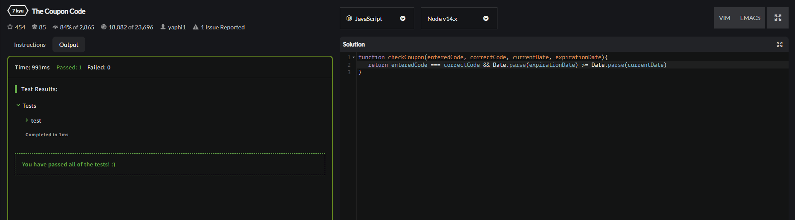
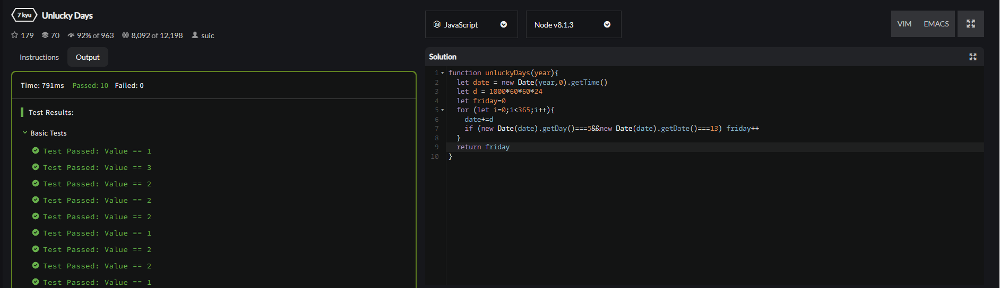
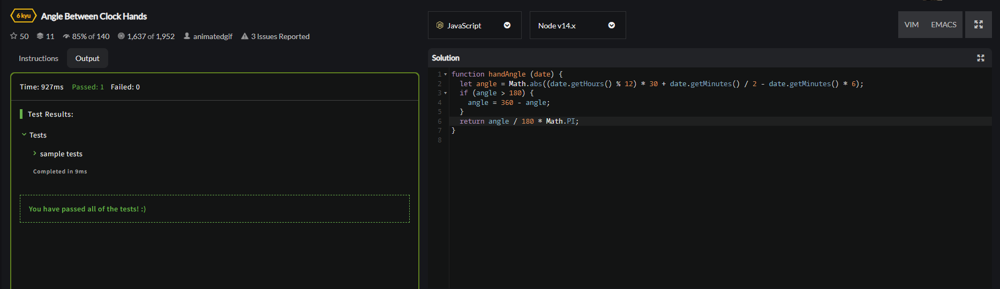
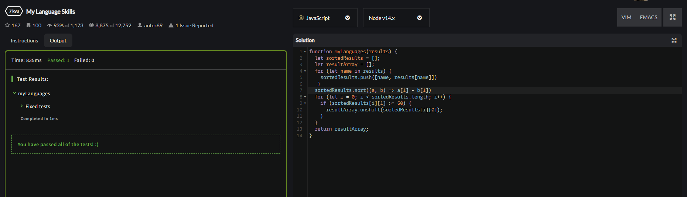
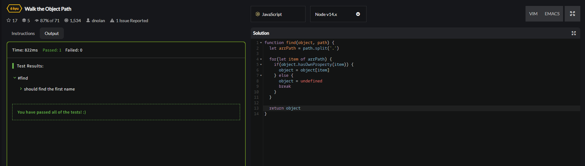

<p <b> align = "center">МИНИСТЕРСТВО НАУКИ И ВЫСШЕГО ОБРАЗОВАНИЯ
РОССИЙСКОЙ ФЕДЕРАЦИИ
ФЕДЕРАЛЬНОЕ ГОСУДАРСТВЕННОЕ БЮДЖЕТНОЕ
ОБРАЗОВАТЕЛЬНОЕ УЧРЕЖДЕНИЕ ВЫСШЕГО ОБРАЗОВАНИЯ
«САХАЛИНСКИЙ ГОСУДАРСТВЕННЫЙ УНИВЕРСИТЕТ» </b> </p>
<br>
<p align = "center">Институт естественных наук и техносферной безопасности</p>
<p align = "center">Кафедра информатики</p>
<p align = "center">Пашаян Самвел Алексанович</p>
<br>
<p align = "center">Лабораторная работа №6</p>
<p align = "center">01.03.02 Прикладная математика и информатика</p>
<br>
<p align = "right" >Научный руководитель</p>
<p align = "right" >Соболев Евгений Игоревич</p>
<p align = "center" >Южно-Сахалинск</p>
<p align = "center" >2022 г.</p>
<p align = "center" ><b>ВВЕДЕНИЕ</b></p>
<p> <b> JavaScript </b> — это язык программирования, который используют для написания frontend- и backend-частей сайтов, а также мобильных приложений. Часто в текстах и обучающих материалах название языка сокращают до JS. Это язык программирования высокого уровня, то есть код на нем понятный и хорошо читается.</p>
<p> JavaScript обычно используется как встраиваемый язык для программного доступа к объектам приложений. Наиболее широкое применение находит в браузерах как язык сценариев для придания интерактивности веб-страницам, для этого даже не требуется компиляция (перевод языка программирования в машинный код). Скрипты можно прописать внутри кода страницы или подключить к HTML отдельным файлом. 
Основные архитектурные черты: динамическая типизация, слабая типизация, автоматическое управление памятью, прототипное программирование, функции как объекты первого класса.</p>
<p align = "center" > РЕШЕНИЕ ЗАДАЧ (ОСНОВНАЯ ЧАСТЬ) </p>

```js 

## Решение:
    let count=0;
    function z1(){
    alert("HelloWorld");
    }

    function z2(){
    let p=document.getElementById("textinput");
    p.value="НовыйТекст";
    }

    function z3(){
    let p=document.getElementById("textinput");
    alert(p.value);
    }
    function z4(){
    let p=document.getElementById("textinput2");
    let x=p.value;
    alert(x*x);
    }

    function z5(){
    let p=document.getElementById("textinput2").value;
    document.getElementById("textinput2").value=document.getElementById("textinput").value;
    document.getElementById("textinput").value=p;
    }

    function z6(){
    document.getElementById("butt6").innerText="НовыйТекст";
    }

    function z7(){
    let p=document.getElementById("textinput2").style.color="red";
    }

    function z8_1(){
    document.getElementById("textinput2").disabled=true;
    }

    function z8(){
    document.getElementById("textinput2").disabled=false;
    }

    function z9(){
    alert("Вы навели мышку на кнопку, а теперь видите результат работы alert");
    }

    function z10(){
    alert("Вы нажали на кнопку два раза, это еще один прикол использования alert :)");
    }

    function z12(){
    let img = document.getElementById("img");
    img.src="dog.jpg";
    }
    }

    function z13(){
    alert("Ура, вы нажали на кнопку");
    }

    function z14(){
    document.getElementById("textinput2").value="Привет!";
    }


    function z15(){
    document.getElementById("butt15").disabled=true;
    alert("Кнопка Заблокирована");
    }

    function z16(){
    count++;
    idfirst.innerText=count;
    }

    function z17(){
    document.getElementById("butt17").style.cursor = "crosshair";
    }

    function z18(){
    document.getElementById("hide").style.display="none";
    }

    function z19(){
    document.getElementById("butt19").style.display="none";
    }

    function z20(){
    document.getElementById("calc").style.display="block";
    }

    function plus(){
    let num1=Number(document.getElementById("num1").value);
    let num2=Number(document.getElementById("num2").value);
    idfirst2.innerText=num1+num2;
    }
    function minus(){
    let num1=Number(document.getElementById("num1").value);
    let num2=Number(document.getElementById("num2").value);
    idfirst2.innerText=num1-num2;
    }
    function mult(){
    let num1=Number(document.getElementById("num1").value);
    let num2=Number(document.getElementById("num2").value);
    idfirst2.innerText=num1*num2;
    }
    function div(){
    let num1=Number(document.getElementById("num1").value);
    let num2=Number(document.getElementById("num2").value);
    idfirst2.innerText=num1/num2;
    }
```
## Задачи CodeWars:






<p align = "center" > ВЫВОД </p>
<p> Итогом работы стало создание странички с использованием языка JS. В ходе выполнения задания, мною были решены все выдвинутые задачи, сформулированные исходя из цели лабораторной работы, и в которых нужно было написать функции, выполняющие то или иное действие при помощи различного применения циклов и условий. Это позволяет сделать вывод, что цель данной лабораторной работы успешно достигнута. </p>